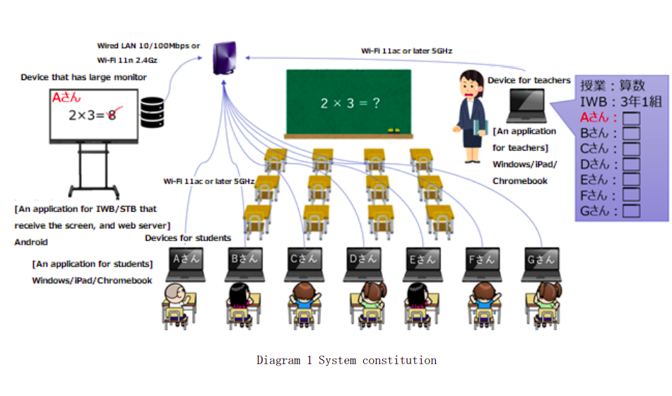
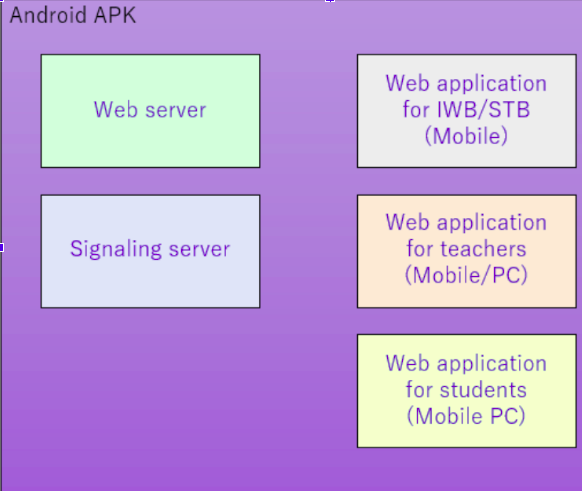
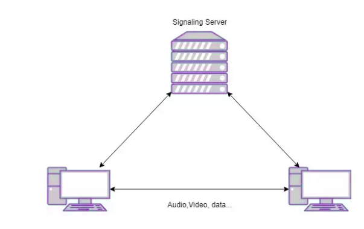
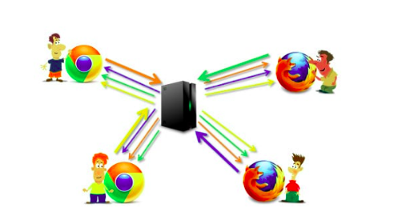
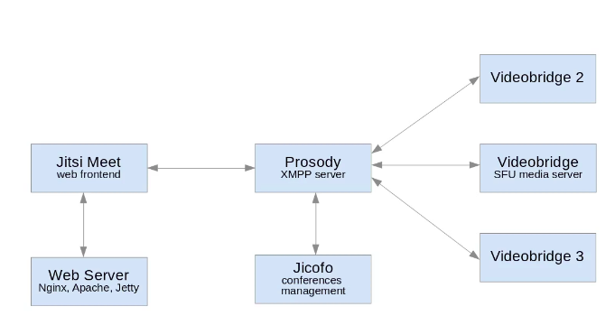
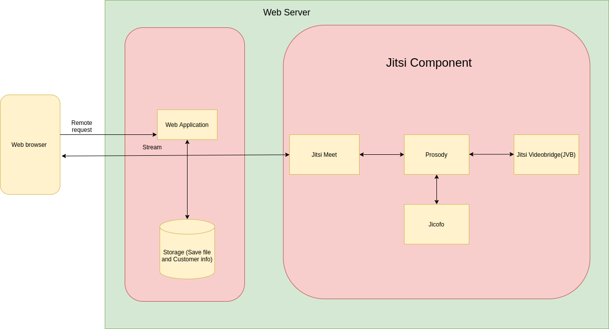
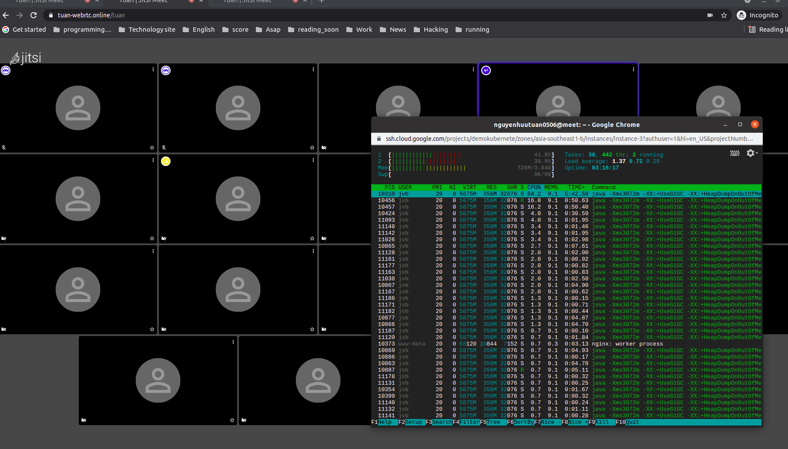

# 1 OVERVIEW

# 

1. Enviroment:
   Local Network
2. Customer Suggestion

   

# SOLUTION

- Use Jitsi Media server
- Use Video Bridge

## Why we use Media server server

- Signaling server approach
  As we can see in the image above, whenever we want to connect to another user, we need to create a peer to add a peer to connect with the two parties. As we can see above, each peer will have 2 connections. Let's say that when we have 10 peers connected to each other, we check that each peer connection takes about 720kbps, if so 10 connection will close to 7mbps. If we use ADSL network with 5mbps band, we cannot connect up to 10 peers.

  

- Media server approach
  With today's device limitations, it's hard for connections to do all of the above. With that need, the idea is to have a separate server, this server is responsible for intermediate transfer/receiving of data streams to peers. With this, the peers only need to receive/transmit the stream from that server. This reduces the burden on the side of the user who is limited by his device

  

## Why we use Jitsi

- Jitsi has gone through a boom time with the pandemic. People are looking for a quality and easy to use solution for video calls and Jitsi provides it.

- High performance: The core of the service is the video bridge node; this service is responsible for managing video streams and it does it very well. Normally CPU won't be an issue only with desktop CPUs, the issue will be bandwidth as all streams have to be received by videobridge which will choose which stream should be sent to each participant.
- Privacy: Chat rooms are only active when they are used, so every time a room is used, it is always new, which makes it impossible for others to connect to an existing room to collect information. Rooms or access to Jitsi can be password protected making it more secure. Encryption is also done automatically across streams, so client-to-server communication is secure. Since the server is probably hosted by you, all communications work under your infrastructure.
- Scalability: Since it is based on services, the system can be easily grown horizontally

- Screen sharing is possible with Chrome Jidesha plugin.
  Collaborative documents using the Etherpad integration service make this solution great for businesses.
  Allow authenticated users or guests to join the room. Very handy for business.

## Why we Use Video Bridge

- Base in customer requirement. Actually there is best feature in Jitsi that is OCTO but we don't need that.
- Video bridge architecture
  

- jitsi-meet-web is the web interface in conjunction with lib-jitsi-meet that provides the libraries related to video support.
- jicofo (the name comes from Jitsi COnference Focus) is a server side focus component.
- jitsi-videobridge is the service that handles the video streams.
- prosody is an XMPP server to manage the rooms and mix up all the services.

# Implement

- deploy video bridge architecture
- Create webserver to call jitsi api (using jitsi api [low level](https://jitsi.github.io/handbook/docs/dev-guide/dev-guide-ljm-api))

## Deploy video bridge architecture

- We need a webserver to deploy jitsi service.

### Requirements

- Linux
- [Docker](https://www.docker.com)
- [Docker Compose](https://docs.docker.com/compose/)

### Quick start for development

- Create a .env file by copying and adjusting env.example
  ```
  cp env.example .env
  ```
- Set strong passwords in the security section options of .env file by running the following bash script

  ```
  ./gen-passwords.sh
  ```

- Create required CONFIG directories
  ```
  mkdir -p ~/.jitsi-meet-cfg/{web/letsencrypt,transcripts,prosody/config,prosody/prosody-plugins-custom,jicofo,jvb,jigasi,jibri}
  ```
- Run `docker-compose up -d`

## Create webserver using using jitsi api

- There are 3 ways to working with jitsi

  - Jitsi webUI (default web UI jitsi)
  - Jitsi Iframe: Can be integrate with Our App [Iframe](https://jitsi.github.io/handbook/docs/dev-guide/dev-guide-iframe) little customize
  - Jitsi API [low level](https://jitsi.github.io/handbook/docs/dev-guide/dev-guide-ljm-api)

- Why we should use Jitsi API: Client require a application more customize and they need transfer file (jitsi don't support). So we need implement jitsi api low level for app

- We need websocket for chat app and transfer file between from client to client.

  

### Technology should be use

- ReactJS for UI. Since jitsi API is very new We have some Repo integration with jitsi API written by community.
- Nodejs for server We will implement Websocket and store files and client information in the backend
- sqlite for database. SQLite is a C-language library that implements a small, fast. SQLite is enough for our APP
- Store file in local machine

# Conclusion:

- The usage of JVBs depends linearly on the number of cpu.

- We can estimate that 1 cpu unit can handle 16 users, 2 can handle 30, 4 for 70-80 and so on.
- Main Web, Jicofo, Prosody don't load much (no chat).
- With support GEO and load balancing JVB, Jitsi can have 1000 user room with 16 JVB instances (4 cpu 8gb ram) if all camera and audio are open or can be much less if presenter only use camera. However that is just theory. I think the client device can't handle the connection above

   19 participants with 2 core 4GB ram. and we can see it consumes about 40% of CPU. I think it will be better when we deploy to the local network. No geographical distance and local network usage
